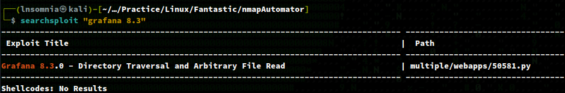
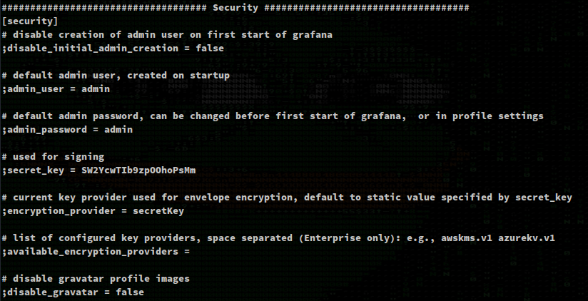

# Recon

We see port 22, 3000, and 9090.

## nmapAutomator.sh (Full)
```
$ sudo ./nmapAutomator.sh -H fantastic.pg -t Full -o full

PORT     STATE SERVICE VERSION
22/tcp   open  ssh     OpenSSH 8.2p1 Ubuntu 4ubuntu0.4 (Ubuntu Linux; protocol 2.0)
| ssh-hostkey: 
|   3072 c1:99:4b:95:22:25:ed:0f:85:20:d3:63:b4:48:bb:cf (RSA)
|   256 0f:44:8b:ad:ad:95:b8:22:6a:f0:36:ac:19:d0:0e:f3 (ECDSA)
|_  256 32:e1:2a:6c:cc:7c:e6:3e:23:f4:80:8d:33:ce:9b:3a (ED25519)
3000/tcp open  ppp?
| fingerprint-strings: 
|   FourOhFourRequest: 
|     HTTP/1.0 302 Found
|     Cache-Control: no-cache
|     Content-Type: text/html; charset=utf-8
|     Expires: -1
|     Location: /login
|     Pragma: no-cache
|     Set-Cookie: redirect_to=%2Fnice%2520ports%252C%2FTri%256Eity.txt%252ebak; Path=/; HttpOnly; SameSite=Lax
|     X-Content-Type-Options: nosniff
|     X-Frame-Options: deny
|     X-Xss-Protection: 1; mode=block
|     Date: Sun, 28 Aug 2022 22:26:50 GMT
|     Content-Length: 29
|     href="/login">Found</a>.
|   GenericLines, Help, Kerberos, RTSPRequest, SSLSessionReq, TLSSessionReq, TerminalServerCookie: 
|     HTTP/1.1 400 Bad Request
|     Content-Type: text/plain; charset=utf-8
|     Connection: close
|     Request
|   GetRequest: 
|     HTTP/1.0 302 Found
|     Cache-Control: no-cache
|     Content-Type: text/html; charset=utf-8
|     Expires: -1
|     Location: /login
|     Pragma: no-cache
|     Set-Cookie: redirect_to=%2F; Path=/; HttpOnly; SameSite=Lax
|     X-Content-Type-Options: nosniff
|     X-Frame-Options: deny
|     X-Xss-Protection: 1; mode=block
|     Date: Sun, 28 Aug 2022 22:26:17 GMT
|     Content-Length: 29
|     href="/login">Found</a>.
|   HTTPOptions: 
|     HTTP/1.0 302 Found
|     Cache-Control: no-cache
|     Expires: -1
|     Location: /login
|     Pragma: no-cache
|     Set-Cookie: redirect_to=%2F; Path=/; HttpOnly; SameSite=Lax
|     X-Content-Type-Options: nosniff
|     X-Frame-Options: deny
|     X-Xss-Protection: 1; mode=block
|     Date: Sun, 28 Aug 2022 22:26:22 GMT
|_    Content-Length: 0
9090/tcp open  http    Golang net/http server (Go-IPFS json-rpc or InfluxDB API)
| http-title: Prometheus Time Series Collection and Processing Server
|_Requested resource was /graph
Service Info: OS: Linux; CPE: cpe:/o:linux:linux_kernel
```


# Enumeration

## Port 3000

We have Grafana v8.3.0.


## Port 9090

We have Prometheus.


After some light enumeration, we find the working version of 2.32.1 which does not seem to be vulnerable.


## Exploit

A quick `searchsploit grafana 8.3` returns an arbitrary file read vuln.



I'll copy this to my working directory with the following command.

`searchsploit -m multiple/webapps/50581.py`

Followed by running the script and successfully reading `/etc/passwd`.


I was also able to read the config file for Grafana at `/etc/grafana/grafana.ini` but it doesn't seem like any important variables are set as they are commented out. I'll just assume the default `secret_key` of `SW2YcwTIb9zpOOhoPsMm` is used.



Looking at `/var/lib/grafana/grafana.db` we also find an encoded password.


`anBneWFNQ2z+IDGhz3a7wxaqjimuglSXTeMvhbvsveZwVzreNJSw+hsV4w==`

After some Googling, I find this article which explains the process of decrypting the password:
https://golangexample.com/grafana-unauthorized-arbitrary-file-reading-vulnerability/

And the program source:
https://github.com/jas502n/Grafana-CVE-2021-43798/blob/main/AESDecrypt.go

I'll edit the go program as so:


Install the `pbkdf2` dependency:

`go get golang.org/x/crypto/pbkdf2`

And run it...

`go run AESDecrypt.go`


We get back `SuperSecureP@ssw0rd`. Testing this on the Grafana login page doesn't work, but since we know ssh port 22 is open and we have a user of `sysadmin`  from reading `/etc/passwd`, then maybe this would work.


And it does!

Executing `id` shows that we are in the `disk` group. 


We can then run `df -h` to show where the `/` directory is mounted, which in this case is `/dev/sda2`.


Now we can use `debugfs` to access the root directory and copy the `id_rsa` for ssh access.


 
Lastly, we'll `chmod 600` the key and ssh as `root`.


