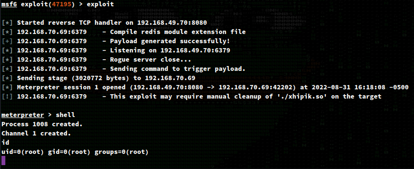

# Recon

## nmapAutomator.sh (Full)
```
$ sudo ./nmapAutomator.sh -H wombo.pg -t Full -o full

PORT      STATE SERVICE    VERSION
22/tcp    open  ssh        OpenSSH 7.4p1 Debian 10+deb9u7 (protocol 2.0)
| ssh-hostkey: 
|   2048 09:80:39:ef:3f:61:a8:d9:e6:fb:04:94:23:c9:ef:a8 (RSA)
|   256 83:f8:6f:50:7a:62:05:aa:15:44:10:f5:4a:c2:f5:a6 (ECDSA)
|_  256 1e:2b:13:30:5c:f1:31:15:b4:e8:f3:d2:c4:e8:05:b5 (ED25519)
80/tcp    open  http       nginx 1.10.3
|_http-title: Welcome to nginx!
|_http-server-header: nginx/1.10.3
6379/tcp  open  redis      Redis key-value store 5.0.9
8080/tcp  open  http-proxy
| fingerprint-strings: 
|   FourOhFourRequest: 
|     HTTP/1.1 404 Not Found
|     X-DNS-Prefetch-Control: off
|     X-Frame-Options: SAMEORIGIN
|     X-Download-Options: noopen
|     X-Content-Type-Options: nosniff
|     X-XSS-Protection: 1; mode=block
|     Referrer-Policy: strict-origin-when-cross-origin
|     X-Powered-By: NodeBB
|     set-cookie: _csrf=b_MehKjjfTFsKiSgxRQUPSBg; Path=/
|     Content-Type: text/html; charset=utf-8
|     Content-Length: 11098
|     ETag: W/"2b5a-iAGr7x9zfAtKBxHDSsGbkKMs8Hc"
|     Vary: Accept-Encoding
|     Date: Wed, 31 Aug 2022 18:14:29 GMT
|     Connection: close
|     <!DOCTYPE html>
|     <html lang="en-GB" data-dir="ltr" style="direction: ltr;" >
|     <head>
|     <title>Not Found | NodeBB</title>
|     <meta name="viewport" content="width&#x3D;device-width, initial-scale&#x3D;1.0" />
|     <meta name="content-type" content="text/html; charset=UTF-8" />
|     <meta name="apple-mobile-web-app-capable" content="yes" />
|     <meta name="mobile-web-app-capable" content="yes" />
|     <meta property="og:site_n
|   GetRequest: 
|     HTTP/1.1 200 OK
|     X-DNS-Prefetch-Control: off
|     X-Frame-Options: SAMEORIGIN
|     X-Download-Options: noopen
|     X-Content-Type-Options: nosniff
|     X-XSS-Protection: 1; mode=block
|     Referrer-Policy: strict-origin-when-cross-origin
|     X-Powered-By: NodeBB
|     set-cookie: _csrf=zLTLwBtPjALf9rNdiZcE96qw; Path=/
|     Content-Type: text/html; charset=utf-8
|     Content-Length: 18181
|     ETag: W/"4705-zhjb68kknkLDasRmr0MmkH2K98k"
|     Vary: Accept-Encoding
|     Date: Wed, 31 Aug 2022 18:14:28 GMT
|     Connection: close
|     <!DOCTYPE html>
|     <html lang="en-GB" data-dir="ltr" style="direction: ltr;" >
|     <head>
|     <title>Home | NodeBB</title>
|     <meta name="viewport" content="width&#x3D;device-width, initial-scale&#x3D;1.0" />
|     <meta name="content-type" content="text/html; charset=UTF-8" />
|     <meta name="apple-mobile-web-app-capable" content="yes" />
|     <meta name="mobile-web-app-capable" content="yes" />
|     <meta property="og:site_name" content
|   HTTPOptions: 
|     HTTP/1.1 200 OK
|     X-DNS-Prefetch-Control: off
|     X-Frame-Options: SAMEORIGIN
|     X-Download-Options: noopen
|     X-Content-Type-Options: nosniff
|     X-XSS-Protection: 1; mode=block
|     Referrer-Policy: strict-origin-when-cross-origin
|     X-Powered-By: NodeBB
|     Allow: GET,HEAD
|     Content-Type: text/html; charset=utf-8
|     Content-Length: 8
|     ETag: W/"8-ZRAf8oNBS3Bjb/SU2GYZCmbtmXg"
|     Vary: Accept-Encoding
|     Date: Wed, 31 Aug 2022 18:14:29 GMT
|     Connection: close
|     GET,HEAD
|   RTSPRequest: 
|     HTTP/1.1 400 Bad Request
|_    Connection: close
| http-robots.txt: 3 disallowed entries 
|_/admin/ /reset/ /compose
|_http-title: Home | NodeBB
27017/tcp open  mongodb    MongoDB 4.0.18
| fingerprint-strings: 
|   FourOhFourRequest, GetRequest: 
|     HTTP/1.0 200 OK
|     Connection: close
|     Content-Type: text/plain
|     Content-Length: 85
|     looks like you are trying to access MongoDB over HTTP on the native driver port.
|   mongodb: 
|     errmsg
|     command serverStatus requires authentication
|     code
|     codeName
|_    Unauthorized
| mongodb-databases: 
|   codeName = Unauthorized
|   code = 13
|   errmsg = command listDatabases requires authentication
|_  ok = 0.0
| mongodb-info: 
|   MongoDB Build info
|     maxBsonObjectSize = 16777216
|     modules
|     sysInfo = deprecated
|     javascriptEngine = mozjs
|     storageEngines
|       1 = ephemeralForTest
|       2 = mmapv1
|       3 = wiredTiger
|       0 = devnull
|     versionArray
|       1 = 0
|       2 = 18
|       3 = 0
|       0 = 4
|     bits = 64
|     debug = false
|     ok = 1.0
|     openssl
|       running = OpenSSL 1.1.0l  10 Sep 2019
|       compiled = OpenSSL 1.1.0l  10 Sep 2019
|     version = 4.0.18
|     buildEnvironment
|       ccflags = -fno-omit-frame-pointer -fno-strict-aliasing -ggdb -pthread -Wall -Wsign-compare -Wno-unknown-pragmas -Winvalid-pch -Werror -O2 -Wno-unused-local-typedefs -Wno-unused-function -Wno-deprecated-declarations -Wno-unused-but-set-variable -Wno-missing-braces -fstack-protector-strong -fno-builtin-memcmp
|       cxxflags = -Woverloaded-virtual -Wno-maybe-uninitialized -std=c++14
|       distmod = debian92
|       target_os = linux
|       cc = /opt/mongodbtoolchain/v2/bin/gcc: gcc (GCC) 5.4.0
|       linkflags = -pthread -Wl,-z,now -rdynamic -Wl,--fatal-warnings -fstack-protector-strong -fuse-ld=gold -Wl,--build-id -Wl,--hash-style=gnu -Wl,-z,noexecstack -Wl,--warn-execstack -Wl,-z,relro
|       cxx = /opt/mongodbtoolchain/v2/bin/g++: g++ (GCC) 5.4.0
|       target_arch = x86_64
|       distarch = x86_64
|     gitVersion = 6883bdfb8b8cff32176b1fd176df04da9165fd67
|     allocator = tcmalloc
|   Server status
|     codeName = Unauthorized
|     code = 13
|     errmsg = command serverStatus requires authentication
|_    ok = 0.0
Service Info: OS: Linux; CPE: cpe:/o:linux:linux_kernel
```


# Enumeration

## Port 80

There is a default nginx welcome page.


I wasn't able to enumerate much out of this port.

## Port 8080

### Website

We see a NodeBB application.


Looking at the source we see some references to `localhost:4567` which is definitely interesting. Maybe something to keep in mind for privilege escalation.


It looks like we are also able to register an account.


User `admin` exists.


Login page is broke?


Robots


Chats


Change pass


Login fix

https://community.nodebb.org/topic/15115/my-login-page-is-blank/3


The above never worked. This seemed to be a dead end.

## Port 27017

Admin access but dead end. No db's, no collections, etc (even on test and not admin)


## Port 6379


I spent a long time trying manual exploitation without luck. I'll say that even with Metasploit, this box was a b****...

