# Recon

## nmapAutomator.sh (Full)
```
$ sudo ./nmapAutomator.sh -H algernon.pg -t Full -o full

PORT      STATE SERVICE       VERSION
21/tcp    open  ftp           Microsoft ftpd
| ftp-syst: 
|_  SYST: Windows_NT
| ftp-anon: Anonymous FTP login allowed (FTP code 230)
| 04-29-20  10:31PM       <DIR>          ImapRetrieval
| 08-29-22  03:15PM       <DIR>          Logs
| 04-29-20  10:31PM       <DIR>          PopRetrieval
|_04-29-20  10:32PM       <DIR>          Spool
80/tcp    open  http          Microsoft IIS httpd 10.0
|_http-server-header: Microsoft-IIS/10.0
| http-methods: 
|_  Potentially risky methods: TRACE
|_http-title: IIS Windows
135/tcp   open  msrpc         Microsoft Windows RPC
139/tcp   open  netbios-ssn   Microsoft Windows netbios-ssn
445/tcp   open  microsoft-ds?
5040/tcp  open  unknown
9998/tcp  open  http          Microsoft IIS httpd 10.0
|_http-server-header: Microsoft-IIS/10.0
| uptime-agent-info: HTTP/1.1 400 Bad Request\x0D
| Content-Type: text/html; charset=us-ascii\x0D
| Server: Microsoft-HTTPAPI/2.0\x0D
| Date: Mon, 29 Aug 2022 22:21:37 GMT\x0D
| Connection: close\x0D
| Content-Length: 326\x0D
| \x0D
| <!DOCTYPE HTML PUBLIC "-//W3C//DTD HTML 4.01//EN""http://www.w3.org/TR/html4/strict.dtd">\x0D
| <HTML><HEAD><TITLE>Bad Request</TITLE>\x0D
| <META HTTP-EQUIV="Content-Type" Content="text/html; charset=us-ascii"></HEAD>\x0D
| <BODY><h2>Bad Request - Invalid Verb</h2>\x0D
| <hr><p>HTTP Error 400. The request verb is invalid.</p>\x0D
|_</BODY></HTML>\x0D
| http-title: Site doesn't have a title (text/html; charset=utf-8).
|_Requested resource was /interface/root
17001/tcp open  remoting      MS .NET Remoting services
49664/tcp open  msrpc         Microsoft Windows RPC
49665/tcp open  msrpc         Microsoft Windows RPC
49666/tcp open  msrpc         Microsoft Windows RPC
49667/tcp open  msrpc         Microsoft Windows RPC
49668/tcp open  msrpc         Microsoft Windows RPC
49669/tcp open  msrpc         Microsoft Windows RPC
```

# nmapAutomator.sh (Recon)

We see anonymous login is allowed on FTP, and something peculiar on port 9998.

```
PORT     STATE SERVICE       VERSION
21/tcp   open  ftp           Microsoft ftpd
| ftp-syst: 
|_  SYST: Windows_NT
| ftp-anon: Anonymous FTP login allowed (FTP code 230)
| 04-29-20  10:31PM       <DIR>          ImapRetrieval
| 07-11-22  08:34AM       <DIR>          Logs
| 04-29-20  10:31PM       <DIR>          PopRetrieval
|_04-29-20  10:32PM       <DIR>          Spool
80/tcp   open  http          Microsoft IIS httpd 10.0
|_http-title: IIS Windows
| http-methods: 
|_  Potentially risky methods: TRACE
|_http-server-header: Microsoft-IIS/10.0
135/tcp  open  msrpc         Microsoft Windows RPC
139/tcp  open  netbios-ssn   Microsoft Windows netbios-ssn
445/tcp  open  microsoft-ds?
9998/tcp open  http          Microsoft IIS httpd 10.0
| http-title: Site doesn't have a title (text/html; charset=utf-8).
|_Requested resource was /interface/root
| uptime-agent-info: HTTP/1.1 400 Bad Request\x0D
| Content-Type: text/html; charset=us-ascii\x0D
| Server: Microsoft-HTTPAPI/2.0\x0D
| Date: Mon, 29 Aug 2022 22:17:32 GMT\x0D
| Connection: close\x0D
| Content-Length: 326\x0D
| \x0D
| <!DOCTYPE HTML PUBLIC "-//W3C//DTD HTML 4.01//EN""http://www.w3.org/TR/html4/strict.dtd">\x0D
| <HTML><HEAD><TITLE>Bad Request</TITLE>\x0D
| <META HTTP-EQUIV="Content-Type" Content="text/html; charset=us-ascii"></HEAD>\x0D
| <BODY><h2>Bad Request - Invalid Verb</h2>\x0D
| <hr><p>HTTP Error 400. The request verb is invalid.</p>\x0D
|_</BODY></HTML>\x0D
|_http-server-header: Microsoft-IIS/10.0
Service Info: OS: Windows; CPE: cpe:/o:microsoft:windows
```

# Enumeration

# Port 21

We connect with `ftp algernon.pg`, follwed by using the username `anonymous` with no password.

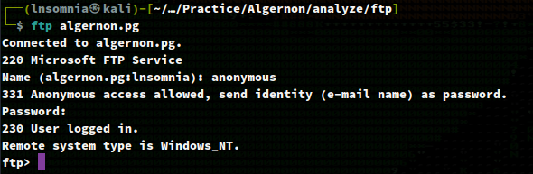

If we `ls`, we see a few directories to enumerate. I'll `cd` into `Logs` and `ls` the contents.

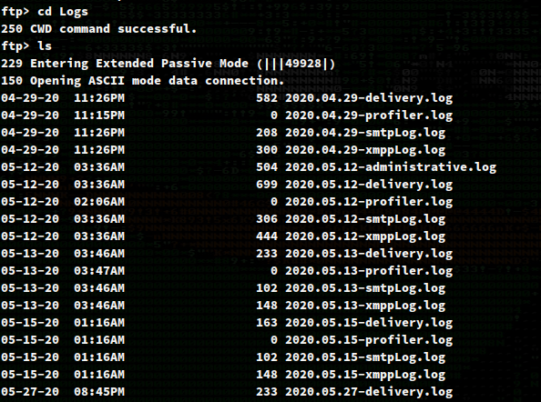

There are quite a number of logs! There is only one with "administrative" in the name, so I'll `get 2020.05.12-administrative.log` to my working directory.

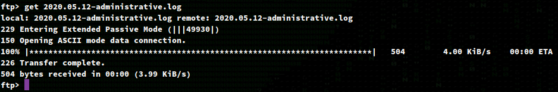

If we `cat 2020.05.12-administrative.log` we can see there is a user named `admin` that initially setup the Webmail on port 9998.

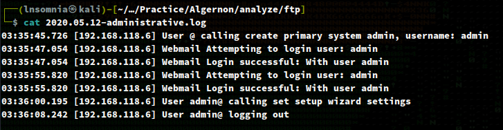

I'll also `get` some other files and `cat` them out.

I'll make note of a `ClamAV` database and will likely obfuscate any future payloads for evasion.

```
$ cat 2022.08.29-delivery.log      
15:15:42.039 Updating ClamAV database...
15:15:52.961 Updating the ClamAV database has completed successfully
```

```
cat 2022.05.02-xmppLog.log 
06:12:29.086 xmpp Started at 5/2/2022 6:12:29 AM
06:12:29.086 Could not start listening on 192.168.120.110:5222 - System.Net.Sockets.SocketException (0x80004005): The requested address is not valid in its context
   at System.Net.Sockets.Socket.DoBind(EndPoint endPointSnapshot, SocketAddress socketAddress)
   at System.Net.Sockets.Socket.Bind(EndPoint localEP)
   at MailService.Protocols.XMPP.Core.XmppServer.StartListening(IPEndPoint ipEndPoint)
```

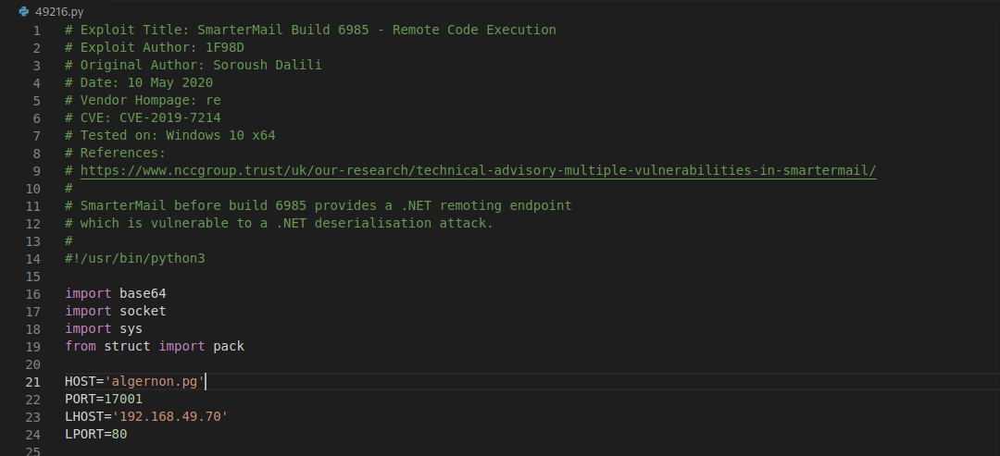

# Port 80

## Website

There is a misconfigured IIS web server. We know from our nmap scripts that this is IIS 10.0 and is not vulnerable.

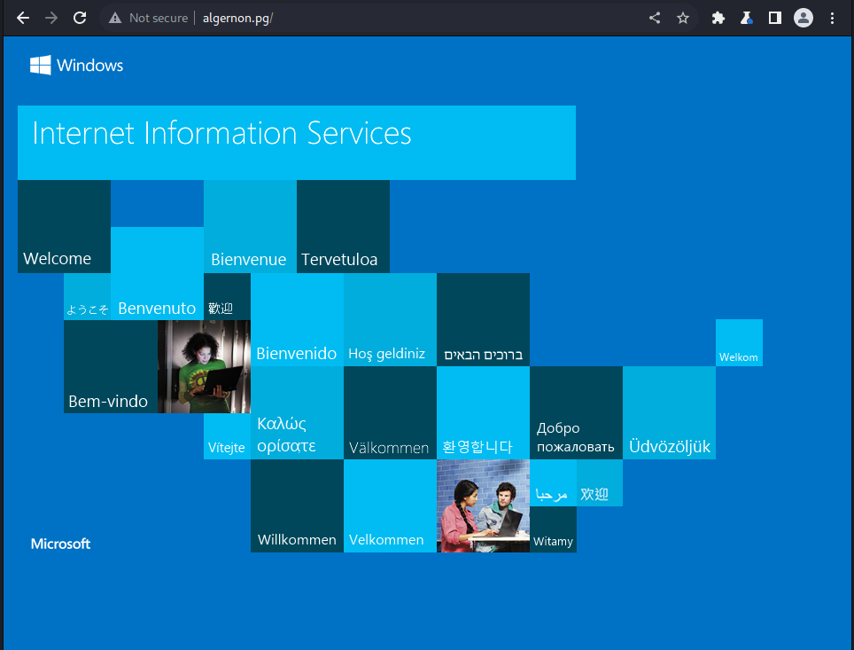

I fuzzed for sub domains, brute forced directories and files, but did not have luck on this path.

# Port 445

I spent some time enumerating different possible shares as a potential null session since this service seemed fairly hardened. Nmap reported version 3.1.1 being used, which searchsploit returns the `SMBGhost` vulnerability, although I think this is explicily for Windows 10 and not IIS as I didn't have any luck with that exploit.

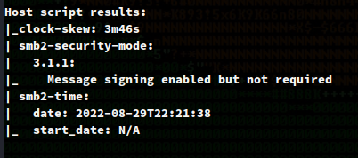

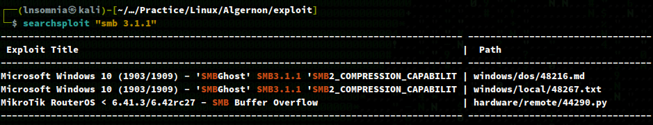

# Port 9998

## Website

This leaves us with port 9998 which is running SmarterMail.

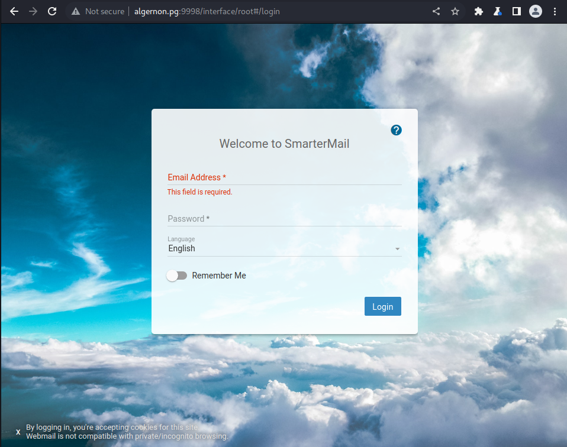

I tried for some random logins and also some I found from documentation, but didn't have any luck. At this point, I started looking at possible exploits for SmarterMail as I had a huntch this might be vulnerable based on the misconfigured IIS server on port 80.

The very first exploit I came across was for CVE-2019-7214:
https://www.exploit-db.com/exploits/49216

I thought this one had a chance as it lined up with the release date of this box, as well as the other services that were running, so I set the required variables as so:
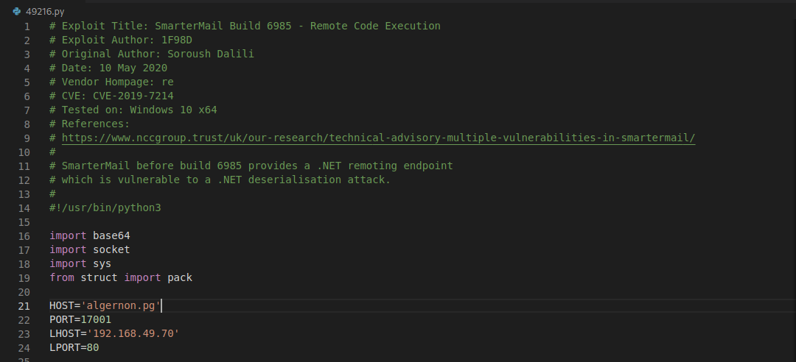

Followed by executing the script using `python3 49216.py` with a listener on port 80.

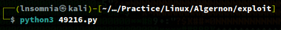

And we get a shell back as `nt authority\system`! 

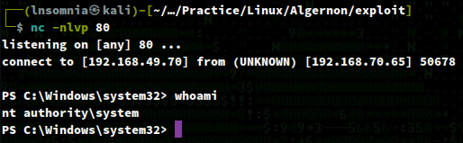