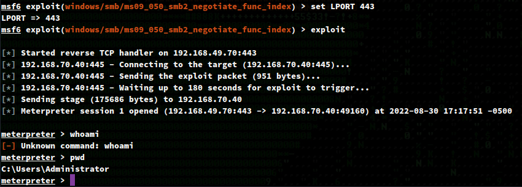
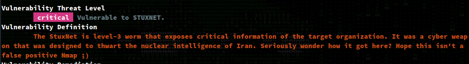

# Recon

## nmapAutomator.sh (Full)
```
$ ./nmapAutomator.sh -H internal.pg -t Full -o full

PORT      STATE SERVICE            VERSION
53/tcp    open  domain             Microsoft DNS 6.0.6001 (17714650) (Windows Server 2008 SP1)
| dns-nsid: 
|_  bind.version: Microsoft DNS 6.0.6001 (17714650)
135/tcp   open  msrpc              Microsoft Windows RPC
139/tcp   open  netbios-ssn        Microsoft Windows netbios-ssn
445/tcp   open  microsoft-ds       Windows Server (R) 2008 Standard 6001 Service Pack 1 microsoft-ds (workgroup: WORKGROUP)
3389/tcp  open  ssl/ms-wbt-server?
| rdp-ntlm-info: 
|   Target_Name: INTERNAL
|   NetBIOS_Domain_Name: INTERNAL
|   NetBIOS_Computer_Name: INTERNAL
|   DNS_Domain_Name: internal
|   DNS_Computer_Name: internal
|   Product_Version: 6.0.6001
|_  System_Time: 2022-08-30T16:01:34+00:00
|_ssl-date: 2022-08-30T16:01:42+00:00; +3m29s from scanner time.
| ssl-cert: Subject: commonName=internal
| Not valid before: 2022-02-14T16:09:44
|_Not valid after:  2022-08-16T16:09:44
5357/tcp  open  http               Microsoft HTTPAPI httpd 2.0 (SSDP/UPnP)
|_http-title: Service Unavailable
|_http-server-header: Microsoft-HTTPAPI/2.0
49152/tcp open  msrpc              Microsoft Windows RPC
49153/tcp open  msrpc              Microsoft Windows RPC
49154/tcp open  msrpc              Microsoft Windows RPC
49155/tcp open  msrpc              Microsoft Windows RPC
49156/tcp open  msrpc              Microsoft Windows RPC
49157/tcp open  msrpc              Microsoft Windows RPC
49158/tcp open  msrpc              Microsoft Windows RPC
Service Info: Host: INTERNAL; OS: Windows; CPE: cpe:/o:microsoft:windows_server_2008::sp1, cpe:/o:microsoft:windows, cpe:/o:microsoft:windows_server_2008:r2

Host script results:
| smb2-time: 
|   date: 2022-08-30T16:01:34
|_  start_date: 2022-02-15T16:09:41
|_nbstat: NetBIOS name: INTERNAL, NetBIOS user: <unknown>, NetBIOS MAC: 00:50:56:ba:18:11 (VMware)
| smb-os-discovery: 
|   OS: Windows Server (R) 2008 Standard 6001 Service Pack 1 (Windows Server (R) 2008 Standard 6.0)
|   OS CPE: cpe:/o:microsoft:windows_server_2008::sp1
|   Computer name: internal
|   NetBIOS computer name: INTERNAL\x00
|   Workgroup: WORKGROUP\x00
|_  System time: 2022-08-30T09:01:34-07:00
| smb-security-mode: 
|   account_used: guest
|   authentication_level: user
|   challenge_response: supported
|_  message_signing: disabled (dangerous, but default)
| smb2-security-mode: 
|   2.0.2: 
|_    Message signing enabled but not required
|_clock-skew: mean: 1h27m29s, deviation: 3h07m50s, median: 3m29s
```


# Enumeration

I Googled  `Windows Server (R) 2008 Standard 6001 Service Pack 1 exploit` and saw a bunch of results for EternalBlue. I've exploited this vulnerability a couple of times and despise the exploits for this vuln as exploitation is kind of hit or miss.

I spent a while trying manual exploits, but eventually just used Metasploit... Hopefully I don't see EternalBlue on the OSCP. If I do, well, then I guess I will bang my head on the table until I get a manual exploit working.

I used `windows/smb/ms09_050_smb2_negotiate_func_index` module for metasploit, set the required vars and ran it.



If only manual exploitation were that easy. 

Fun fact -- nmap reported this box as vulnerable to STUXNET. Maybe it is just an FP, idk, I didn't look into it and just thought it was funny.

